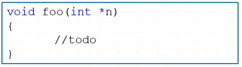
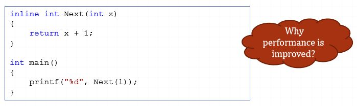
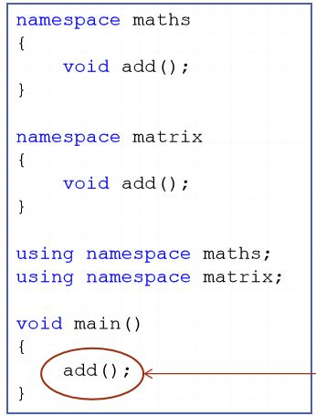

# Getting start
- Variables and constant
- Primary data type
- Array –String
- Data structure: enum–struct
- Function
- Namespace

## Variables and constant <br />

1. Auto variable:
- As default, a variable is a auto variable
```C++
int myVar
/* is actually */
auto int myVar
```
- Go out of scope once the program exits from the current block
2. Static variable:
- Allocated when the program starts and is
deallocated when the program ends.
- Default value is zero(0)<br />


3. Register variable:
- Stored in a machine register if possible
- Usually used in “for iterator” for improve
performance <br />

4. Extern variable:
- Specify that the variable is declared in a
different file.
- Compiler will not allocate memory for the
variable
- Avoid duplicate declaration
- Share (global) variable for multiple .cpp files <br />


5. Constant:
- Variable's value is constant
- To prevent the programmer from modifying<br />


## Primary data type<br />

1. New type definition <br />

2. `sizeof` operator
- Return size (in byte) of a type, data structure, variable
```C++
int sizeInt = sizeof(int);
int sizeLong = sizeof(long);
```

## Array –String
1. Array
- Used to store consecutive values of the same data types <br />
`int b[4] = {1, 2, 3, 4};`
- N-dimensions array <br />
`int b[<s1>][<s2>]…[<sn>]` `si` MUST BE constant
- Index of array is counted from 0 to(si-1)
- C/C++ do not handle out-of-range exception <br />

2. Array Assignment <br />

3. Array Assignment 2D Array <br />

4. C/C++ String
- No standard string in C/C++
- Use char*, or char[] instead
- String in C/C++ is array of byte, end with ‘\0’<br />

5. String allocation
- Static allocation
```C++
char *st = "String";
char st2[] = "String";
```
- Dynamic allocation
```C++
char *st3 = new char[6];
st3[0] = 's';
st3[1] = 't';
st3[2] = 'i';
st3[3] = 'n';
st3[4] = 'g';
st3[5] = '\0';
```

## Data structure: enum–struct
1. Enum
- Use for set up collections of named integer constants
    - In traditional C way: <br />
    
    - Alternate approach <br />
    
- Declaration <br />

- Values of enum constants <br />

2. Struct
- Define a structure type and/or a variable of a structure type<br />
- 
- Using struct: <br />

3. Struct-function <br />

- **C++ only, not available in C**
- Beside variable, struct also has had function
- Struct alignment is not effected to struct-function
- Function is not counted when calculate struct
size<br />

4. Struct constructor / destructor
- C++ only, not available in C
- Two special function of struct
    - Constructor: automatically call when a instant of structis created
    - Destructor: automatically call when a instant of structis destroy <br />


5. Structand static member
- Static function & static variable
- Static variable is not counted is struct alignment and struct size <br />

6. Structand Access privilege
- C++ only, not available in C
- Three access privilege methods
    - public: visible for all
    - private: visible inside struct only
    - protected: visible inside structand
retrieved struct(OOP)
- Default is public
- For example: valxis public <br />

## Function<br />
<return-type> function_name([<type> <param>], […]) <br />

1. Default parameters <br />


2. Variable number of parameters <br />

3. Parameter classification <br />
- Value parameter
- Reference parameter
- Constant parameter
- Const Reference parameter
- Pointer parameter
***Value parameter***
- Pass-by-value
- A copy of parameter is made <br />

* **Reference parameter**
- Pass-by-reference
- Actually parameter itself is passed
- Use reference operator “&” <br />

*** Constant parameter**
- Pass-by-value
- A copy of parameter is made and strict as const. <br />

*** Const Reference parameter**
- Pass-by-ref
- Actually parameter itself is passed but avoid modify
- Avoid the overhead of creating a copy<br />

*** Pointer parameter**
- In common, Pass-by-value
- A copy of parameter is made <br />
Value of parameter is an address of a memory block <br />

- Value of parameter will not be change,
- but memory block which pointed by parameter could be modified
4. Function overloading
- C++ only
- Allow multiple functions with the same name, so long as they have different parameters <br />

5. Function Prototype
- In C/C++, functions MUST BE declare before using.
- To solve this problems
    - Keep all functions in correct order
    - Use prototype inside .cpp file
    - Use prototype inside header (.h) file -> recommend <br />
    
6. Extern function
- Sometimes, we need to use a function in another module (.cppfile)
- Header file is too complicated to use (caused error when used) <br />

7. Inline function
- Macro: preprocessor replaces all macro calls directly with the macro code <br />

- Like macro, but obeys C/C++ syntax

- For OOP ,Inline function is allowed to set access privilege
- Improve performance (for short/simple inline functions)
- NOTE: The compiler is not forced to inline anything at all
## Namespace
1. Namespace:
- A abstract container uses for grouping source code.
- In C++, a namespace is defined with a namespace block <br />

2. Using namespace
- For using methods, variables, … of a namespace:
`<namespace>::<methods/variables>` <br />


3. Namespace –ambiguous call <br />

- More than two definition of add functions
    - maths::add()
    - matrix::add()
> ambiguous call fatal error. 

- In this case, MUST BE specify namespace. <br />

# Reference 
[cppreference.com](https://en.cppreference.com/w/)
[cplusplus.com](http://www.cplusplus.com/reference/)