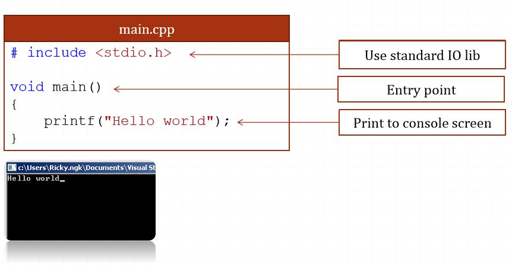
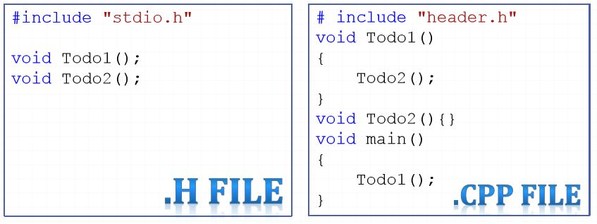
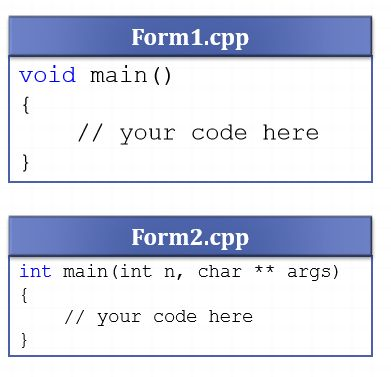
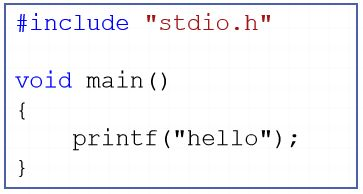
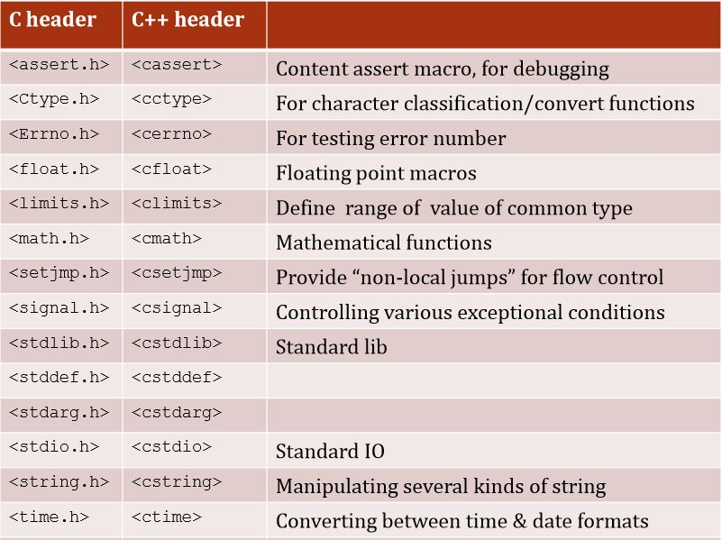
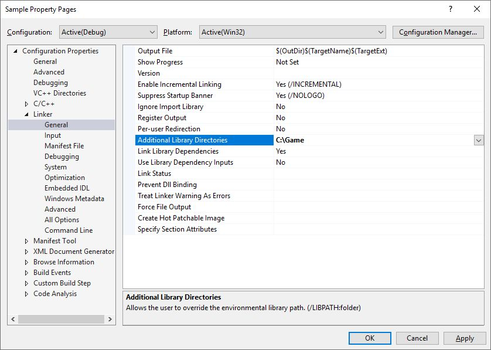

# Preparation
- Hello world
- C/C++ file
- Entry point 
- C/C++ libraries
- Compile process

1. Hello world 

2. C/C++ file
- Header file (.h)
    - aka include file
    - Hold declarations for other files use
(prototype)
    - Not required
- Source file (.c / .cpp)
    - Content implementation
    - Required  

3. Entry point 
- Required unique entry point
- The most common is: main 

4. C/C++ libraries
- C/C++ support a set of internal basic library, such as
    - Basic IO
    - Math
    - Memory handle
    - …
- For using, include the header file
    - #include <…>
    - #include "…"  

- [Reference](http://www.cplusplus.com/reference/) 

- C/C++ user-defined lib
    - Not C/C++ standard lib
    - Come from:
        - Third-party
        - User own
    - In common, include 2 parts
        - .h files & .lib files: for developer
        - .dll file (dynamic library): for end-user
    - For using
        - Include .h files
        - Inform .lib files to compiler
        - Copy all .dll file to (if any) :
            - same folder with execute file
            - to system32 (windows) – not recommend
- Declare path to .lib 

- Declare .lib file 

5. Compile process 

